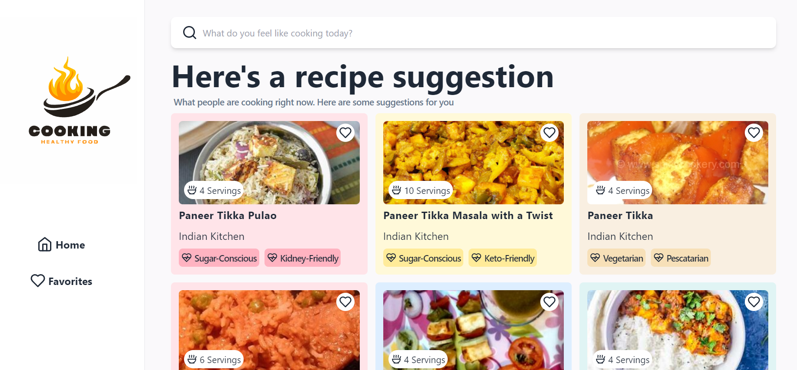

# Recipe App



## Description

This React application is designed to help users find recipes for various food items quickly and easily. By simply entering the name of a food item, users can access a variety of related recipes. Upon selecting a recipe, users are redirected to a YouTube video that demonstrates how to prepare the dish, making the cooking process straightforward and enjoyable.

## Key Features

Recipe Search: Users can search for recipes by entering the name of a food item.
Diverse Recipe Options: The app fetches multiple recipes for each food item, giving users a variety of choices.

YouTube Integration: Each recipe link directs users to a YouTube video tutorial for step-by-step cooking instructions.

User-Friendly Interface: The app features an intuitive and clean interface, making it easy to navigate and find recipes.

Responsive Design: The application is fully responsive, providing an optimal viewing experience on desktops, tablets, and mobile devices.

## Technologies Used

- React
- JavaScript
- Tailwind CSS
- YouTube API
- Edamam API

## Installation

1. Clone the repository:

   ```bash
   git clone https://github.com/kratin01/find-your-recipe.git
   ```

2. Install dependencies:

   ```bash
   npm install
   ```

3. Start the development server:

   ```bash
   npm run dev
   ```

4. Open the app in your browser:

   ```bash
   http://localhost:3000
   ```
